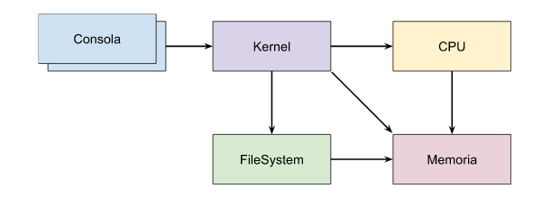

# T.U.K.I - The Ultimate Kernel Implementation

El enunciado del proyecto se encuentra [aquí](https://docs.google.com/document/d/1orfThJsPmMx5uPzbY3wClGhqX8jASMOCUMlWnYAr7cA/edit).

## Descripción del Proyecto

T.U.K.I (The Ultimate Kernel Implementation) es un proyecto académico desarrollado para simular un sistema operativo distribuido. A través de este trabajo, los estudiantes se familiarizan con conceptos avanzados de sistemas operativos, aprenden a utilizar diversas herramientas de programación y aplican teorías vistas en clase mediante una implementación práctica.

## Objetivos del Trabajo Práctico

- Adquirir conocimientos prácticos sobre el uso de APIs y herramientas de programación proporcionadas por los sistemas operativos.
- Comprender los aspectos del diseño de un sistema operativo.
- Reforzar conceptos teóricos mediante su implementación práctica.
- Familiarizarse con técnicas de programación de sistemas como el uso de makefiles, archivos de configuración y logs.
- Entender en detalle la operación de Linux utilizando un lenguaje de programación de bajo nivel como C.

## Arquitectura del Sistema

El sistema se compone de cinco módulos:

- Consola: Múltiples instancias que crean procesos.
- Kernel: Administra y planifica la ejecución de procesos.
- CPU: Ejecuta las instrucciones de los procesos.
- Memoria: Administra el espacio de memoria usando segmentación.
- File System: Administra y persiste los archivos creados por los procesos.

## Flujo de Ejecución

1. Consola: Envía información al Kernel para crear estructuras de administración.
2. Kernel: Crea y planifica la ejecución de procesos mediante diversos algoritmos.
3. CPU: Ejecuta las instrucciones y realiza peticiones a la Memoria y/o Kernel.
4. Memoria: Administra el espacio de memoria y responde a las peticiones.
5. File System: Gestiona archivos, respondiendo a peticiones del Kernel y haciendo peticiones a la Memoria.

Una vez finalizado un proceso, el Kernel notifica a la Consola correspondiente y cierra la conexión.

## Módulos Detallados

### 1. Consola

- Función: Inicia y envía procesos al Kernel.
- Configuración: Recibe un archivo de configuración y un archivo de pseudocódigo con las instrucciones.
- Instrucciones: Parseo de líneas con formato específico para enviar al Kernel.

### 2. Kernel

- Función: Gestión y planificación de la ejecución de procesos.
- Diagrama de Estados: Utiliza un diagrama de cinco estados para la planificación.
- PCB: Estructura base para administrar procesos.
- Planificadores:
  - Largo Plazo: Algoritmo FIFO.
  - Corto Plazo: Algoritmos FIFO y HRRN.

### 3. CPU

- Función: Ejecuta las instrucciones de los procesos.
- Ciclo de Instrucción: Comprende fetch, decode, y execute.
- MMU: Unidad de administración de memoria para la traducción de direcciones.

### 4. Memoria

- Función: Administra el espacio de memoria.
- Esquema de Segmentación: Implementa y gestiona la memoria segmentada.

### 5. File System

- Función: Administra y persiste los archivos.
- Esquema Indexado: Similar al tipo Unix o ext2.

## Evaluación del Trabajo Práctico

La evaluación consta de dos etapas:

- Pruebas de Programas: Realizadas en el laboratorio.
- Coloquio: Defensa teórica y práctica del trabajo realizado.

## Deployment

- Distribución de Procesos: Los procesos pueden ejecutarse en diversas computadoras.
- Automatización del Despliegue: Es responsabilidad del grupo automatizar el despliegue con los archivos de configuración correspondientes.

## Guía para Deployment

La guíase encuentra en el archivo [La Guia definitiva SO.txt].

## Puesta en Marcha del Trabajo Práctico

Los módulos se deben levantar en el siguiente orden para asegurar el correcto funcionamiento de las conexiones:

1. Memoria: `./bin/memory.out memory.config IP Escucha (ej 0.0.0.0)`
2. File System: `./bin/filesystem.out filesystem.config IP Escucha(ej 0.0.0.0)`
3. CPU: `./bin/cpu.out cpu.config IP Escucha`
4. Kernel: `./bin/kernel.out kernel.config IP Escucha`
5. Consola: `./bin/console.out console.config instrucciones.txt`

